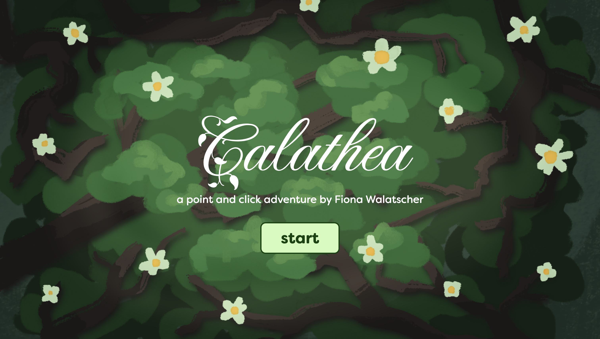
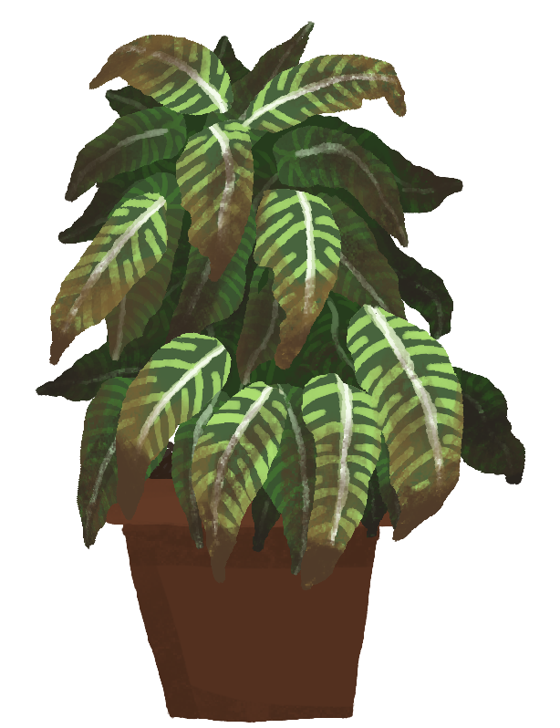
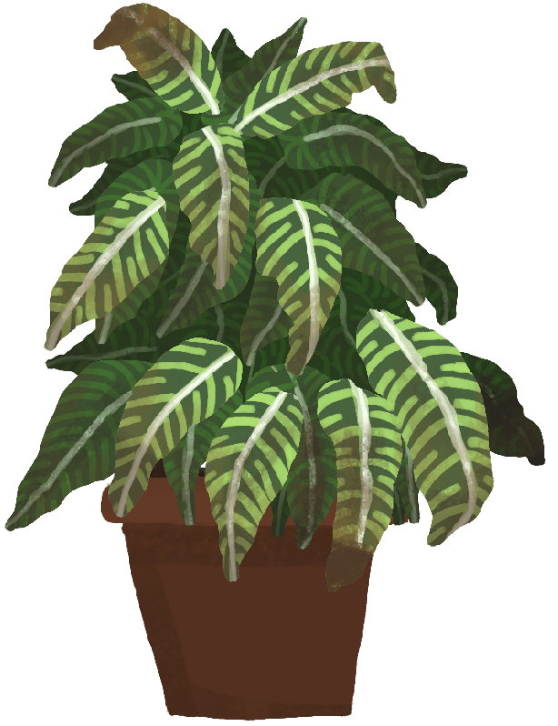
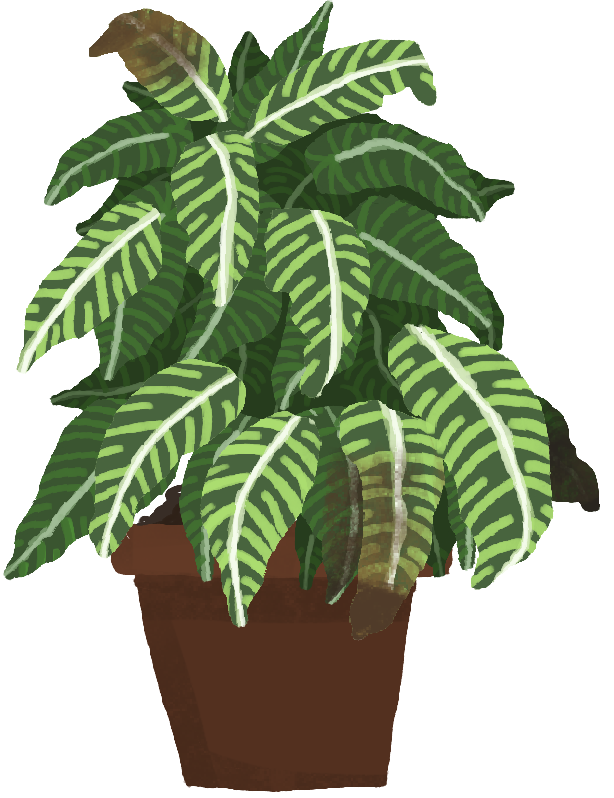
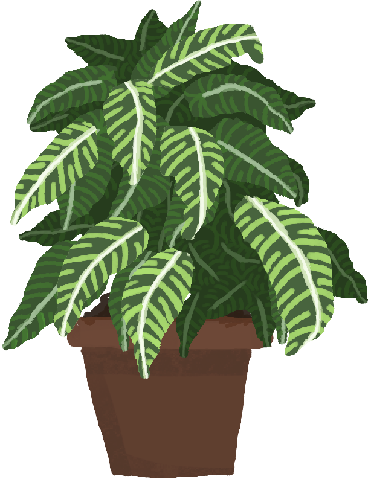
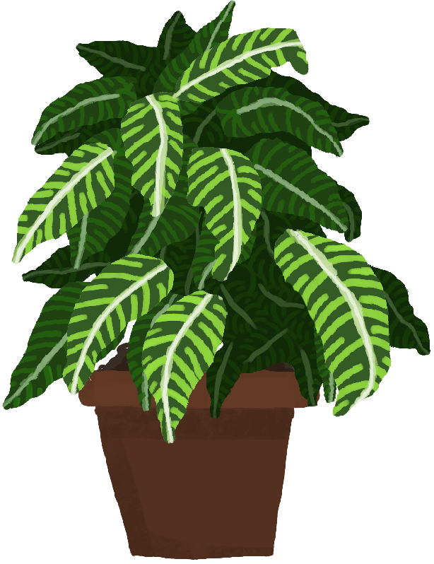
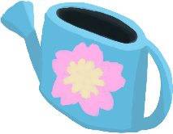

# 🌾 **Calathea** 

> **Short Pitch**:
> 
> Find your way through different rooms of a greenhouse and use items to help plants in need, with the objective to safe the calathea in the centre of the greenhouse.

---

## 🌱 **Play Calathea Here**
[Click here to play the game!](link)

---

## 📸 **Screenshots**

### Main Gameplay:

  
  
*Figure 1: Player's view when they start the game.*

---

### Menu and UI:

  
  
*Figure 2: Start screen of the game.*

---

## 🎨 **Art – Objects and Animations**
Every clickable object in the game is printed onto the canvas seperately, and thus exists as png.
Although there's no classic player character or enemies, background animations were included in two rooms.

### Plants and Items:

  
  
  
  
  
/*  
*Figures 3-7: Different appearances of the calathea throughout the gameplay.*
 */

  
  
  
  
/*  
*Figure 8-11: An assortment of clickable items in the game.*
 */

---

## 🥀 **Reflection**

### What went well:
- **Creative Design:** The theme and style came together seamlessly, and the sprites were fun to design.

### Challenges:

### Lessons Learned:
